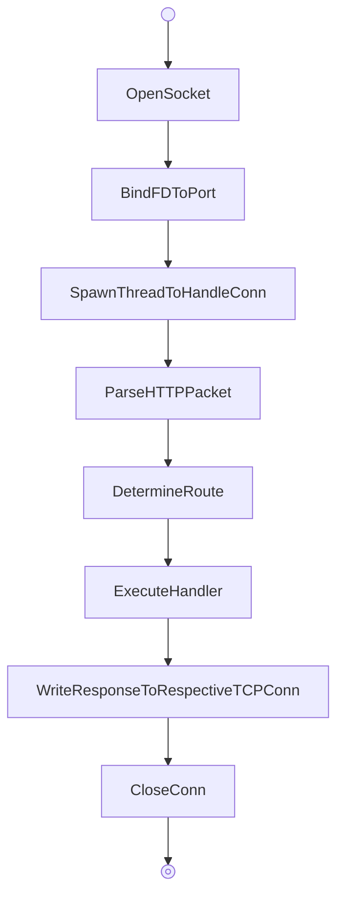

# HTTP server from scratch

```mermaid
flowchart
    Start@{ shape: 'small-circle' }
    End@{ shape: 'framed-circle' }

    Start --> OpenSocket --> BindFDToPort --> SpawnThreadToHandleConn --> ParseHTTPPacket --> DetermineRoute --> ExecuteHandler --> WriteResponseToRespectiveTCPConn --> CloseConn --> End
```