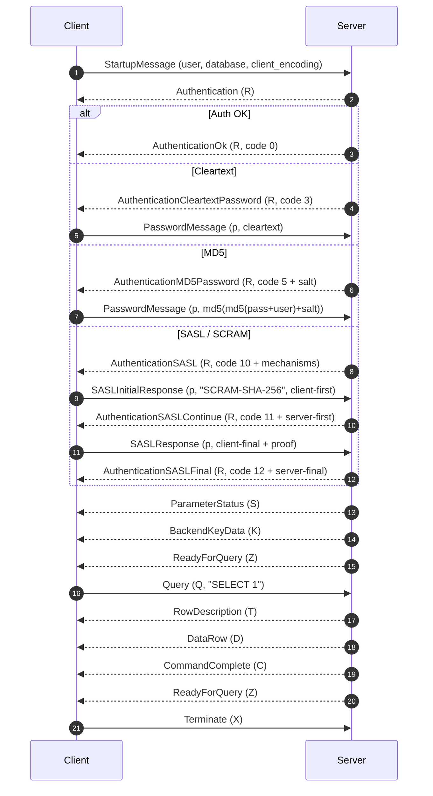

# Raw Postgres Connection (Protocol v3)

This project implements a minimal PostgreSQL client using the v3 wire protocol.
It connects over TCP, performs authentication (including SCRAM-SHA-256), sends a
simple query, parses the first row, and terminates cleanly.

## Protocol Flow

## Message Types Used

- StartupMessage (no type byte): protocol version + key/value params + terminator.
- Authentication (R): server challenges for auth and indicates method.
- PasswordMessage / SASL messages (p): client responses for auth.
- ParameterStatus (S), BackendKeyData (K): informational, ignored in this client.
- ReadyForQuery (Z): server is idle and ready for commands.
- Query (Q): simple query protocol (not extended).
- RowDescription (T), DataRow (D), CommandComplete (C): minimal query results.
- ErrorResponse (E): decoded to show severity, SQLSTATE, and message.

## Authentication Mechanisms

The server selects an auth method via `Authentication` (R):

- 0: AuthenticationOk (no auth needed).
- 3: Cleartext password.
- 5: MD5 password (`md5(md5(password+user)+salt)`).
- 10/11/12: SASL with SCRAM-SHA-256.

For SCRAM-SHA-256, the client follows RFC 5802 / RFC 7677:

1) Client-first-message: `n,,n=user,r=client_nonce`
2) Server-first-message: `r=combined_nonce,s=base64_salt,i=iterations`
3) Client-final-message: `c=biws,r=combined_nonce,p=proof`
4) Server-final-message: `v=server_signature`

The code derives the salted password using PBKDF2-HMAC-SHA256 and computes
the client proof and server signature per the SCRAM spec.

## Where This Lives in Code

- Startup and message framing:
  - `sendStartup`, `sendTyped`, `readMsg`
- Auth loop and dispatch:
  - `authAndWaitReady`, `handleAuth`
- MD5 auth:
  - `md5Password`
- SCRAM / SASL:
  - `pickSCRAMMechanism`, `initSCRAM`, `sendSASLInitialResponse`,
    `sendSASLResponse`, `scramState.handleServerFirst`,
    `scramState.handleServerFinal`, `pbkdf2SHA256`
- Query and result:
  - `sendQuery`, `readFirstFieldFromFirstRow`, `parseFirstField`
- Error parsing:
  - `parseError`
