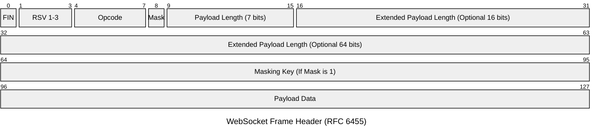

```mermaid
packet-beta
title WebSocket Frame Header (RFC 6455)
0-0: "FIN"
1-3: "RSV 1-3"
4-7: "Opcode"
8-8: "Mask"
9-15: "Payload Length (7 bits)"
16-31: "Extended Payload Length (Optional 16 bits)"
32-63: "Extended Payload Length (Optional 64 bits)"
64-95: "Masking Key (If Mask is 1)"
96-127: "Payload Data"
```
