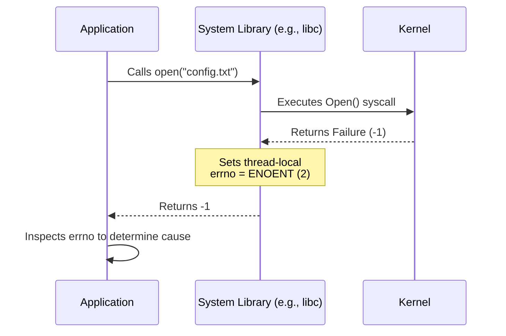

# Understanding `errno`

This document explains the general concept of `errno` in operating systems. It is intended for software developers seeking to understand how system calls and library functions communicate error states to user-space applications.

## What is `errno`?

An `errno` (error number) is an integer variable used by POSIX-compliant operating systems (including Linux, macOS, and Unix). It acts as a standardized communication channel from the operating system kernel to the application, indicating precisely why a requested operation failed.

## How Error Reporting Works

When an application requests a service from the kernel—such as opening a file or allocating memory—it executes a system call. The kernel attempts to fulfill this request and dictates the control flow based on the result:

1. **Success**: The system call returns a value indicating success (often `0` or the number of bytes processed). The kernel leaves the absolute value of the `errno` variable unchanged.
2. **Failure**: The system call returns a generic error indicator (typically `-1` or a `NULL` pointer). Simultaneously, the kernel writes a specific error code into the `errno` variable to describe the failure.

## Common Error Codes

Operating systems define standard `errno` macros in system header files. Each macro maps to a specific integer value and represents a distinct failure scenario.

- `ENOENT` (Error NO ENTry): The requested file or directory does not exist.
- `EACCES` (Error ACCESs): The process lacks the required permissions.
- `EINVAL` (Error INVALid): The application provided an invalid argument.
- `EAGAIN` (Error AGAIN): A resource is temporarily unavailable; the operation should be retried later.

## Thread Safety

Historically, early systems implemented `errno` as a single global variable. In modern, multi-threaded environments, a shared global variable would cause race conditions, where one thread's system call failure could overwrite another thread's error state.

To solve this, contemporary operating systems implement `errno` as a thread-local variable. Each thread maintains its own isolated `errno` value. System calls in one thread cannot overwrite or interfere with the error codes of another thread.

## Best Practices

Follow these guidelines when interacting with `errno`:

- **Check immediately**: Read the `errno` value immediately after a system call fails. Subsequent library calls might overwrite the variable, even if those subsequent calls succeed.
- **Ignore on success**: Do not evaluate `errno` if the preceding system call succeeded. A successful function call is not required to clear the variable; it might contain a leftover error code from a prior, unrelated operation.
- **Translate appropriately**: Do not map integer values to error messages manually in your code. Rely on standard library or language-specific helper functions (like `strerror` in C) to generate human-readable descriptions associated with the error numbers.
