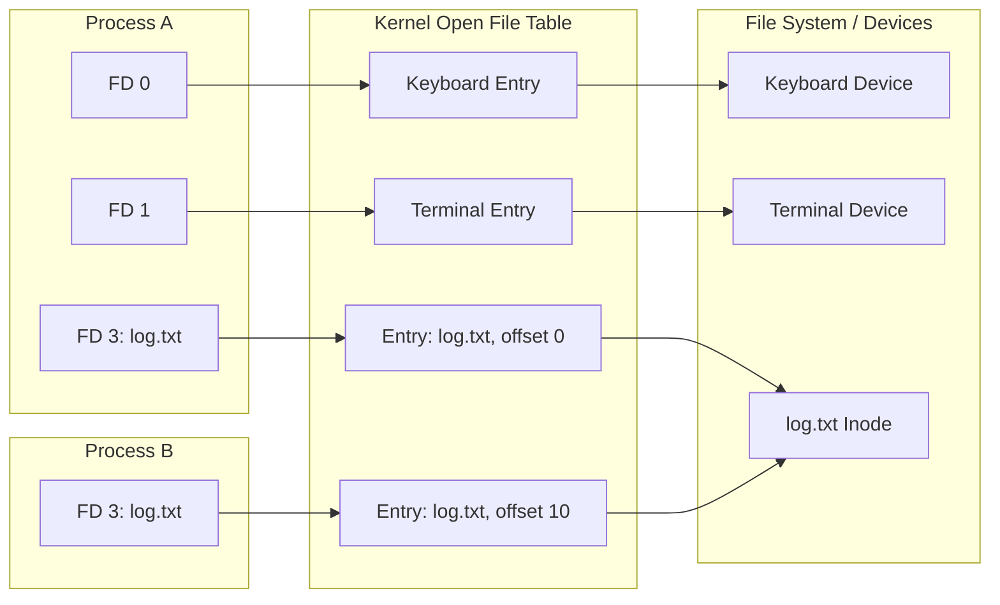

# File Descriptors in Unix/Linux Systems

## Document Overview

**Audience:** Software engineers, system administrators, and students looking to understand the fundamental concept of file descriptors in Unix/Linux operating systems.
**Purpose:** To explain what file descriptors are, how the operating system manages them, and their practical implications in software development.

## What is a File Descriptor?

A file descriptor (FD) is a non-negative integer that uniquely identifies an open file within a process in a Unix-like operating system.

In Unix, "everything is a file." This philosophy means file descriptors represent not only regular text or binary files, but also directories, network sockets, pipes, character devices, and block devices. When a process opens any of these resources, the operating system kernel returns a file descriptor. The process then uses this integer for subsequent operations, such as reading, writing, or closing the resource.

## Standard File Descriptors

By default, every Unix/Linux process starts with three standard file descriptors automatically opened by the environment:

| Integer | Name            | POSIX Macro     | Purpose                               | Default Destination |
| ------- | --------------- | --------------- | ------------------------------------- | ------------------- |
| 0       | Standard Input  | `STDIN_FILENO`  | Reads input into the process          | Keyboard / Terminal |
| 1       | Standard Output | `STDOUT_FILENO` | Writes normal output from the process | Terminal Screen     |
| 2       | Standard Error  | `STDERR_FILENO` | Writes error messages and diagnostics | Terminal Screen     |

## How the Kernel Manages File Descriptors

The kernel maintains three distinct data structures to safely and efficiently manage open files across the entire system.

1. **Per-Process File Descriptor Table:**
   - Each process holds its own independent table.
   - The table maps a file descriptor integer to an entry in the system-wide Open File Table.
2. **System-Wide Open File Table:**
   - This single table tracks all currently open files across all active processes.
   - Entries include session-specific information: the current file offset (where the next read or write will occur), access mode (read, write, or append), and a pointer to the underlying file system entry.
3. **File System Inode Table:**
   - This table holds the actual metadata for the file on disk (or the network socket state).
   - Multiple open file table entries can point to the exact same inode.



_The relationship between process-level file descriptor tables, the kernel's open file table, and the underlying file system inodes. Process A and Process B have opened the same file independently._

## Practical Implications

### File Descriptor Limits

Operating systems enforce limits on the number of open file descriptors to prevent a single buggy or malicious process from exhausting system memory and denying service to other applications.

- **Soft Limit:** The maximum number of file descriptors a process is currently allowed to open. A process can programmatically increase its own soft limit up to the value of the hard limit.
- **Hard Limit:** The absolute capability ceiling defined by the system administrator. Only the root user can increase a hard limit.

To view your system limits in an active shell, run:

```bash
ulimit -n
```

### Resource Leaks

If a program opens a file but forgets to explicitly close it before destroying the reference to the file descriptor, that integer and its associated kernel memory remain allocated. Over time, this causes a **file descriptor leak**.

Once the process hits its file descriptor limit, subsequent attempts to open files or establish network connections will fail abruptly, typically resulting in the error code `EMFILE` ("Too many open files").

### Redirection and Piping

Command-line shells manipulate file descriptors transparently to implement input/output redirection and piping:

- **Redirection (`>` or `<`):** Writing standard output to a file instead of the terminal (`command > output.txt`). The shell modifies FD 1 before launching the command, repointing it from the terminal to the specified file.
- **Piping (`|`):** Connecting the standard output of one process directly to the standard input of another (`command1 | command2`). The shell creates an in-memory pipe and repoints FD 1 of the first command and FD 0 of the second command to this pipe.

## Code Example: Managing File Descriptors in C

This minimal example demonstrates the lifecycle of a file descriptor: opening a resource, utilizing it for output, and properly releasing it to prevent leaks.

```c
#include <fcntl.h>
#include <unistd.h>
#include <stdio.h>

int main() {
    // 1. Open a file descriptor
    // O_WRONLY: Write-only mode
    // O_CREAT: Create file if it doesn't already exist
    // 0o644: Unix permissions (Read/write for owner, read for group/others)
    int fd = open("output.txt", O_WRONLY | O_CREAT, 0o644);

    if (fd == -1) {
        perror("Failed to open file descriptor");
        return 1;
    }

    // 2. Write to the file descriptor
    const char *message = "Hello, File Descriptor!\n";
    ssize_t bytes_written = write(fd, message, 24);

    if (bytes_written == -1) {
        perror("Failed to write to file descriptor");

        // Ensure closure even on failure
        close(fd);
        return 1;
    }

    // 3. Close the file descriptor to prevent resource leaks
    close(fd);

    return 0;
}
```

## Summary

- A file descriptor is an integer handle mapping a process to an open system resource, like a file or socket.
- Processes automatically start with FD 0 (stdin), 1 (stdout), and 2 (stderr).
- The operating system kernel tracks descriptors using process-specific, system-wide, and inode-level tables.
- Systems enforce limits on open file descriptors to ensure stability.
- Always explicitly close file descriptors when finished to prevent resource exhaustion.
